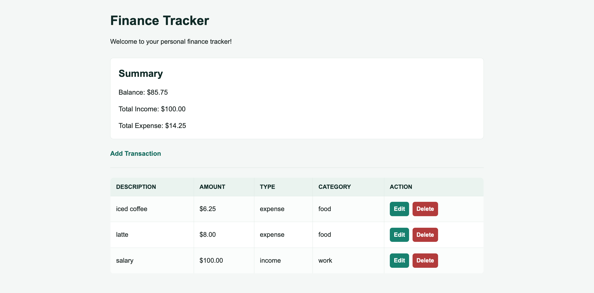

# Simple Finance Tracker

A simple personal finance tracker built with Flask and SQLite.

## Screenshot

## Features

- Add transactions
- Edit transactions
- Delete transactions
- Dashboard summary
- Responsive UI

## Tech Stack

- Python
- Flask
- SQLAlchemy
- SQLite
- HTML/CSS

## Installation

1. Clone the repository:
   `git clone https://github.com/itsnotming/simple-finance-tracker.git`

2. Enter the project directory:
   `cd simple-finance-tracker`

3. Create and activate a virtual environment:
   `python -m venv venv`
   `source venv/bin/activate`

4. Install the dependencies:
   `pip install -r requirements.txt`

5. Run the application:
   `python run.py`

6. Open `http://127.0.0.1:5000` in your browser.
